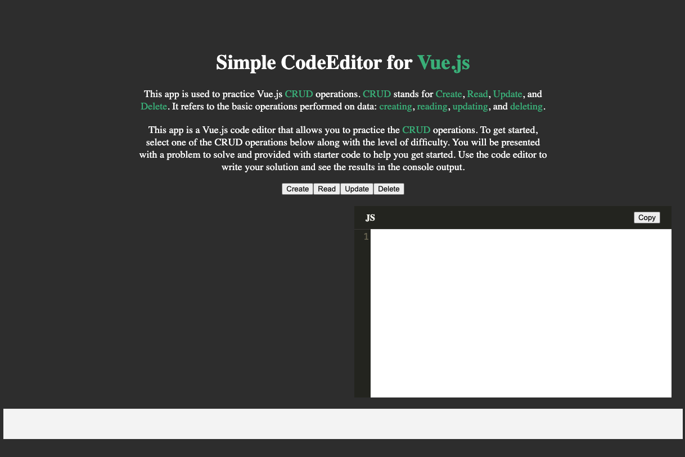

# 📝 Vue Coding Lab 📝

Vue Coding Lab is an interactive web application designed to help developers practice their Vue.js skills by focusing on the fundamental CRUD (Create, Read, Update, Delete) operations. By providing a code editor and a set of challenges, Vue Coding Lab enables users to gain hands-on experience in implementing these operations using Vue.js.

As its name suggests, Vue Coding Lab serves as a virtual laboratory where users can experiment with Vue.js and sharpen their coding abilities. The app offers a user-friendly interface that guides developers through various CRUD challenges, encouraging them to apply their knowledge and problem-solving skills.

The app provides a selection of CRUD operations and allows users to choose the level of difficulty. Once a challenge is selected, users are presented with a specific problem statement and given starter code to get started. The provided code serves as a helpful foundation, focusing the user's attention on implementing the missing functionality for the specific CRUD operation.

Whether you are a beginner learning Vue.js or an experienced developer looking to reinforce your skills, Vue Coding Lab provides a valuable platform for honing your abilities and deepening your understanding of CRUD operations in a Vue.js environment.

## Live Website 🌐

### [Vue Coding Lab](https://vue-code-lab.vercel.app/)

## Developer 🤝

### 🧑‍💻 [David Benner](https://github.com/davebenner14)

## Technologies Used 💻

- [Vue.js](https://vuejs.org/guide/introduction.html)
- [JavaScript](https://developer.mozilla.org/en-US/docs/Web/JavaScript)
- [HTML](https://developer.mozilla.org/en-US/docs/Web/HTML)
- [CSS](https://developer.mozilla.org/en-US/docs/Web/CSS)

## Screenshots 📸



## Getting Started Yourself 🚀

To get started with this project, follow these steps:

First, install Vue CLI, if you haven't already, using the following command:

```
npm install -g @vue/cli
```

Create a new Vue.js project using:

```
vue create <project name>
```

Install the required dependencies:

```
npm install
```

Test your application:

```
npm run serve
```

## Components 📚

The project consists of several components that work together to manage tasks and provide email functionality. Here are some examples:

### CodeEditor.vue

The CodeEditor component is responsible for rendering a code editor interface where users can write and modify their code. It provides syntax highlighting, line numbers, and the ability to copy the code to the clipboard.

```
<template>
  <div class="editor">
    <div class="editor-header">
      <span class="editor-label">JS</span>
      <CopyButton @copy="copyToClipboard" :copied="copied" />
    </div>
    <codemirror v-model="code" :options="options" @input="updateCode" />
  </div>
</template>

<script>
import CopyButton from "./CopyButton";
import "@/components/CodeEditor.css";

export default {
  props: {
    challenge: Object,
    currentCode: String, // declare currentCode as a prop
  },
  data() {
    return {
      code: "",
      copied: false,
      options: {
        lineNumbers: true,
        mode: "javascript",
        theme: "monokai",
      },
    };
  },
  methods: {
    updateCode(newCode) {
      this.$emit("code-updated", newCode);
    },
    copyToClipboard() {
      navigator.clipboard.writeText(this.code).then(
        () => {
          this.copied = true;
          setTimeout(() => {
            this.copied = false;
          }, 2000);
        },
        () => {
          console.error("Failed to copy!");
        }
      );
    },
  },
  components: {
    CopyButton,
  },
  mounted() {
    require("@/assets/monokai.css");
  },
  watch: {
    challenge(newChallenge) {
      if (newChallenge) {
        this.code = ""; // reset the code on every new challenge
      }
    },
    currentCode(newCode) {
      // watch for changes in currentCode
      if (newCode !== this.code) {
        this.code = newCode; // update the code if currentCode changes
      }
    },
  },
};
</script>
```

The CodeEditor component in the Vue Coding Lab app provides users with an intuitive code editing interface using the CodeMirror library. It enables syntax highlighting, line numbers, and a JavaScript mode. Users can input and modify their code, which is managed through the code data property using v-model. The component includes a language label, a copy button powered by the CopyButton component, and a code-updated event that emits the updated code. It initializes the code editor options, applies necessary styling, and watches for changes in the challenge and current code props. Overall, the CodeEditor component enhances the coding experience for practicing CRUD operations in the Vue Coding Lab app.

### ChallengeSelector.vue

The ChallengeSelector component allows users to select a CRUD operation and a difficulty level for the coding challenges they want to practice.

```
<template>
  <div>
    <div v-if="!selectedCrudOperation">
      <button
        v-for="operation in crudOperations"
        :key="operation"
        @click="selectCrudOperation(operation)"
      >
        {{ operation }}
      </button>
    </div>

    <div v-else>
      <button
        v-for="level in difficultyLevels"
        :key="level"
        @click="selectDifficultyLevel(level)"
      >
        {{ level }}
      </button>
    </div>
  </div>
</template>

<script>
export default {
  data() {
    return {
      selectedCrudOperation: null,
      crudOperations: ["Create", "Read", "Update", "Delete"],
      difficultyLevels: ["Beginner", "Intermediate", "Expert"],
    };
  },
  methods: {
    selectCrudOperation(operation) {
      this.selectedCrudOperation = operation;
    },
    selectDifficultyLevel(level) {
      this.$emit("challenge-selected", {
        operation: this.selectedCrudOperation,
        level: level,
      });
      this.selectedCrudOperation = null;
    },
  },
};
</script>

```

The ChallengeSelector component in the Vue Coding Lab app allows users to choose a CRUD operation and difficulty level for coding challenges. It renders buttons based on the current state: displaying CRUD operation buttons if no operation is selected and difficulty level buttons once a CRUD operation is chosen. When a button is clicked, the corresponding method is called to update the selected operation or emit the selected challenge information. This user-friendly interface empowers users to select specific challenges for practice and enhances their experience in the Vue Coding Lab app.

## Going Forward 🚀

Welcome to Vue Coding Lab, your platform for practicing CRUD operations using Vue.js. Take advantage of this app to enhance your skills and become proficient in creating, reading, updating, and deleting data. I am excited to hear your feedback and suggestions to make the app even better. Your valuable input will contribute to the continued growth of Vue Coding Lab. Happy practicing, and let's embark on this coding journey together!
